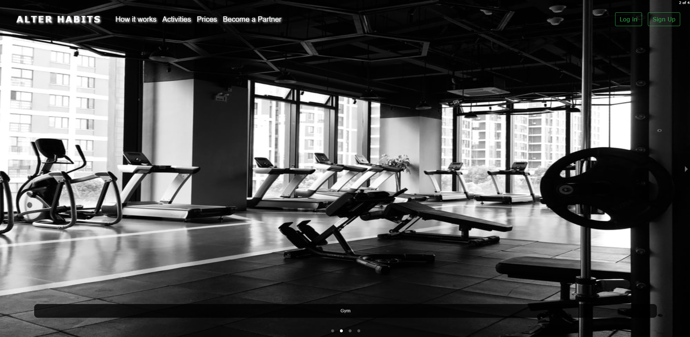
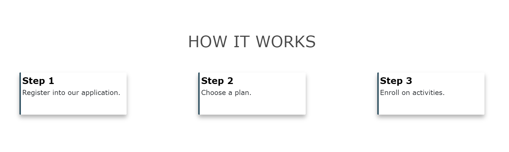
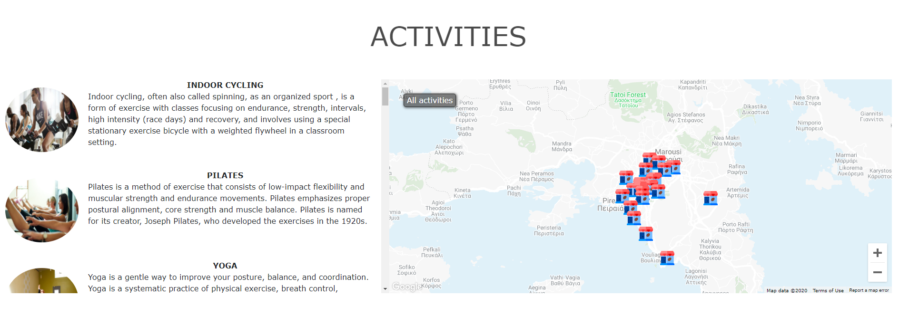
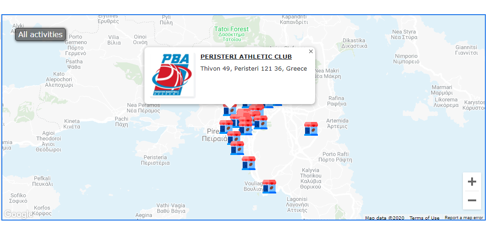
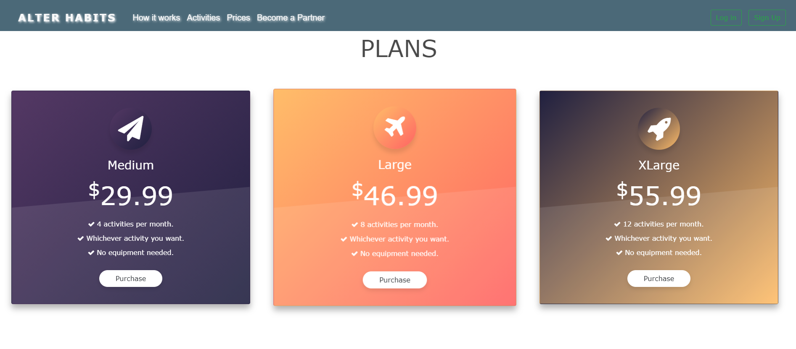
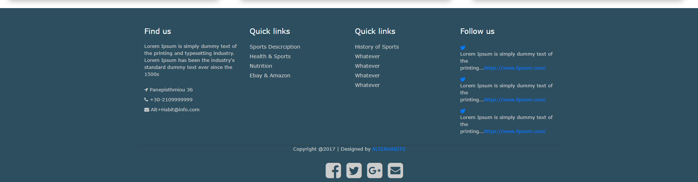
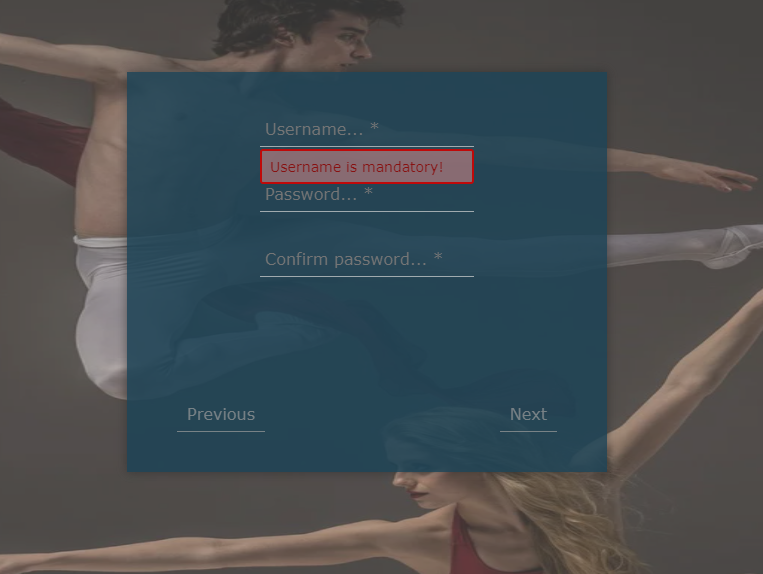
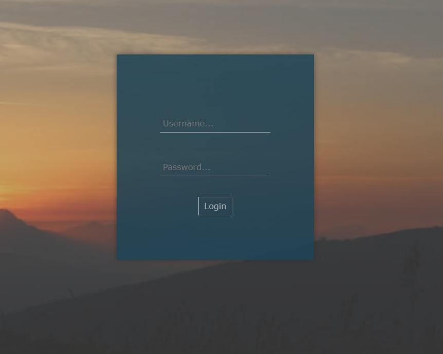
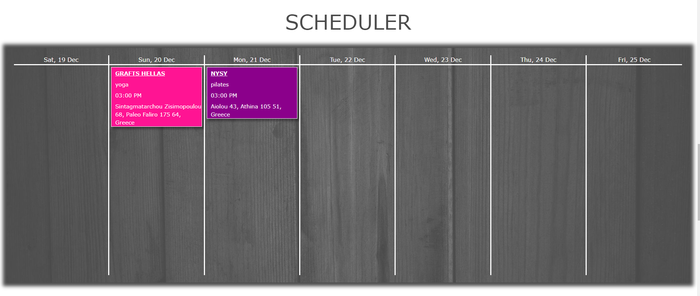
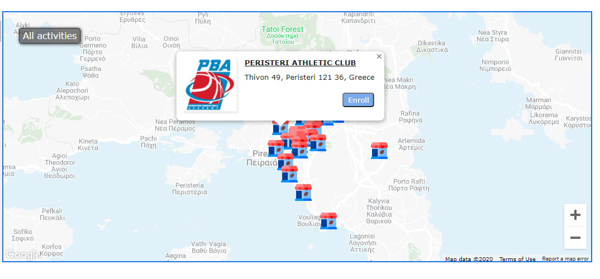

<!-- # AlterHabits Back End implementation.
Back End implemented using Spring Rest APIs that provided AlterHabits' React App any data needed for the view.
The app also uses JWT Spring Boot for security.
Furthermore in this repository anyone can see the database schema queries. -->

<!-- # AlterHabits React App.
Implementation of the View on AlterHabits web application using React framework.
The application is retrieving any data needed to be rendered through asychronous requests on
Spring Rest APIs on Back End. -->

## Name

Alter Habits

## Description

Alter Habits idea was basically to create an application for people who are bored of the gym or do not want to engage exclusively in any sporting activity but still want to take part on them. They should have the opportunity to pick among various sporting activities (e.g. dance, football, karate...)  without having to only participate to one of them, or have to pay a full subscription to each one of them. Based on that idea Alter Habits provides users with a number of appointments (based on a subscription) available to use in a variety of sports and activities shown in the application. 

The application has been separated into two smaller ones and is based on <a href="https://en.wikipedia.org/wiki/Model%E2%80%93view%E2%80%93controller">MVC</a> software design pattern. The front end application (View) located in <ins>front-end</ins> folder is created using Javascript and specifically ReactJS library. The back end application (Controller) located in <ins>back-end</ins> folder is implemented using the Spring Framework. REST APIs are created providing any data needed, from the View, in JSON format. The data are persisted in a MySQL database (Model). 

### Features

Project's key features include:\
\
&emsp;&#8226;&emsp;Unique user account (based on <a href="https://jwt.io/introduction/">JWT</a> authentication)\
\
&emsp;&#8226;&emsp;Display of Shops on map\
\
&emsp;&#8226;&emsp;Asychronous update of Shops displayed based on Activity filtering\
\
&emsp;&#8226;&emsp;Make an activity appointment\
\
&emsp;&#8226;&emsp;Scheduler keeping track of appointments up to 7 days ahead\
\
&emsp;&#8226;&emsp;Recommendation Quiz suggesting up to 3 activities to user, based on his answers\
\
&emsp;&#8226;&emsp;Become a Partner and make your own Shop available in Map's Shops

## Demonstration

First thing you'll notice being on Alter Habits web application is the SPA (<a href="https://en.wikipedia.org/wiki/Single-page_application">Single-page application</a>) philosophy.

### Components being displayed as Guest user:

#### Navigation Bar

#### Photos' Carousel

#### How it works

#### Activities & Shops

As you may have noticed on the GIF above, picking on an activity will filter the map, showing only the shops providing that activity.
This functionality is basically the same either as a guest or as a registered user, except that registered users will get a button saying "Enroll", displayed on shop's modal box of information that we'll talk more about later on the demonstration. Below is shop's modal box as a Guest.

#### Plans

Picking a plan will result in opening the registration modal.

#### Footer

### Registration & Login

If guest user wants to register on Alter Habits, he/she must click the "Sign up" button displayed on navigation bar and fill out the form of registeration.

Validations are implemented on both front end and back end.

After finishing registration, user is redirected on Alter Habits page and there he can press the "Log in" button resulting in opening the log in modal box asking for user's username and password.

### Components being displayed as Registered user:

After user logs in the application with his/her account, he/she will notice that most od the components are pretty much the same.
Below the differences will be demonstrated.

#### Navigation Bar

The prices option has been replaced with Scheduler option.

Also "Log in" and "Sign up" buttons have been replaced by number of appointments, "Quiz" button and "Log out" button.

#### Quiz

Based on user's quiz's answers, the application will suggest activities that user might like.

#### Scheduler

Picking the "Scheduler" option on navigation bar, user will be transferred on the Scheduler component, which has replaced the Plans component.
Scheduler will inform user about forthcoming appointments upt to 7 days.

#### Shop's Modal Box

As mentioned earlier, also shops' modal box will change. Now user can enroll on any of chosen shop's activities (as long as he/she has at least one appointment left for this month).

### Appointment

Below is demonstrated the procedure of making a new appointment and the asynchronous update of scheduler and number of appointments.

### Become a Partner

Registered users and Guest users both have the "Become a Partner" option in navigation bar where, by filling a form with information needed from the application, user can apply for becoming a partner of Alter Habits and add his shop on the map. Below is the procedure.

You will notice that submitting the form, will result in making an asynchronous addition of your shop, in Alter Habits map, but clicking on the shop registered users won't be able to enroll on any of the shop's activities and will be informed that the shop is a potential future partner (until an admin accepts potential partners' application).

## Technology & Tools

<a href="https://www.java.com/en/download/">Java 8</a>  
<a href="https://netbeans.org/">Apache NetBeans IDE</a>  
<a href="https://code.visualstudio.com/">Visual Studio Code IDE</a>
<a href="https://maven.apache.org/">Maven</a>  
<a href="https://spring.io/projects/spring-boot">Spring Boot</a>  
&emsp;&#8226;&emsp;Spring Boot DevTools\
&emsp;&#8226;&emsp;Spring Web MVC\
&emsp;&#8226;&emsp;Spring Data JPA\
&emsp;&#8226;&emsp;Spring Security\
<a href="https://reactjs.org/">ReactJS</a>  

## Collaborators

&emsp;&#8226;&emsp;**Dimitris Katsamagos** <a href="https://www.linkedin.com/in/dimitris-katsamagos/">LinkedIn</a> <a href="https://github.com/dkatsamagos">GitHub</a>\
&emsp;&#8226;&emsp;**John Latsis** <a href="https://www.linkedin.com/in/john-latsis-19b437144/">LinkedIn</a> <a href="https://github.com/Latselot">GitHub</a>\
&emsp;&#8226;&emsp;**Vaggelis Leventelis** <a href="https://www.linkedin.com/in/vaggelis-leventelis/">LinkedIn</a> <a href="https://github.com/LeventelisV">GitHub</a>
